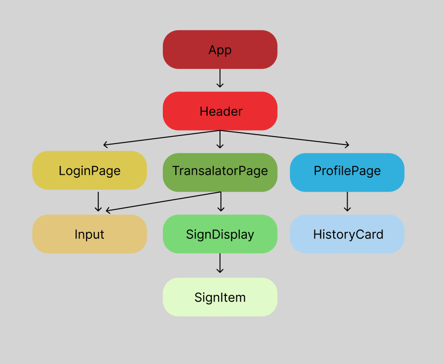

# Noroff Frontend Assignment 2

This project is a frontend application for the Noroff Assignment 2, implementing a sign language translator using React and Vite.

## Table of Contents 
- [Getting Started](#getting-started)
  - [Prerequisites](#prerequisites)
  - [Installation](#installation)
- [Usage](#usage)
- [Development](#development)
  - [Running Locally](#running-locally)
  - [Building the Project](#building-the-project)
- [Contributing](#contributing)
- [License](#license)
## Getting Started

### Prerequisites
- Node.js (LTS version recommended)
- npm or yarn
### Installation 
1. Clone the repository:

```bash

git clone https://github.com/Kirderf/noroff-frontend-assignment2.git
``` 
2. Install dependencies:

```bash

cd noroff-frontend-assignment2
npm install
```
## Usage

To use the application, follow the steps under [Getting Started](#getting-started)  to set up the project. Once the project is set up, you can run it locally and access the application through your browser.
## Development
### Running Locally

To run the application locally for development:

```bash

npm run dev
```


This will start the development server, and you can access the application at `http://localhost:5173`.
### Building the Project

To build the project for production:

```bash

npm run build
```


This will create a production-ready build in the `dist` directory.
## Contributing

Contributions are welcome! If you'd like to contribute to this project, please follow the standard GitHub fork, branch, and pull request workflow.
## License

This project is licensed under the [MIT License](#LICENSE)
